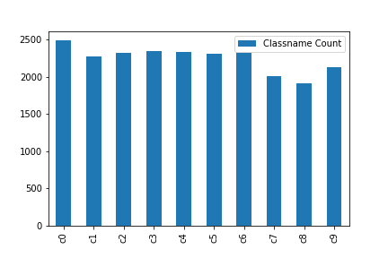

# 开题报告-走神司机检测

## 项目概述

本项目名为"走神司机检测"，来自于kaggle的一项检测司机开车途中驾驶状态的竞赛项目, 驾驶状态的意思是司机在开车途中的姿势。现实中，司机在开车途中可能有些小动作比如玩手机，导致注意力被分散，影响其安全驾驶，轻则影响交通，重则发生交通事故，据报道，2016年浙江省因交通事故死亡4187人，像开车使用手机，分心驾驶等影响安全行为共导致交通事故死亡1855人，占全省交通事故死亡总数的44.3%；研究资料表明：开车打电话导致事故的风险比通常情况下高出4倍，其危险程度不亚于酒后驾驶，甚至在结束通话后的10分钟风险仍然很高。使用手机的司机应急反应慢于酒驾，注意力下降37%、刹车反应慢19%、变更车道的能力下降20%[1]，可见安全驾驶仍然是当前急需解决重大问题之一。因此本项目目的在于通过车上的摄像头监控司机的驾驶状态，判断其状态是否符合安全驾驶，如果不符合则通过通过语音提醒司机。本项目只专注于对司机驾驶状态的检测上做研究。
为解决本项目的识别司机驾驶状态问题，本项目采用深度学习及图像处理技术来解决，此技术已用在人脸识别、车辆检测以及车牌识别中得到不错的成果，比如当今最著名的人脸识别测试集(LFW)，目前深度学习可以达到99.47%的识别率[2][3]。因此通过安装在车上的摄像头监控司机，将图像上传至云端服务器，利用深度学习及图像处理技术，识别出该图像中司机的驾驶状态。基于安全驾驶的问题上，本项目可以适用于几乎所有开车的司机。

## 问题陈述

在本项目的问题属于监督学习的多分类问题，即识别图像中的司机属于10种驾驶状态里的哪一类驾驶状态，由于Kaggle竞赛所提供的数据集是采集自现实中的26名司机的十种驾驶状态图像，所拍摄的司机具有相同朝向，不同的在于司机人物的性别，身高体型，肤色，发型和服装等外在因素不同，以及部分图像的不同背景亮度和清晰度都会加大识别难度。处理此问题先经过从图像中提取不同级别的特征，将此特征输入到已经被训练好的分类模型中，得出该特征对于10种驾驶状态中，每一种状态的概率。

## 数据研究

驾驶状态的意思是司机在开车途中的姿势，本项目定义了10种驾驶状态，分别为：
* c0: 安全驾驶
* c1: 右手打字
* c2: 右手打电话
* c3: 左手打字
* c4: 左手打电话
* c5: 调收音机
* c6: 喝饮料
* c7: 拿后面的东西
* c8: 整理头发和化妆
* c9: 和其他乘客说话

项目提供的数据包含标注了10种状态的训练集，混淆了10种状态具有79726张图片的测试集，以及26名司机对于每种驾驶状态图片的清单文件(driver_imgs_list.csv)，图片大小均为640x480，以下按照清单文件统计出来的训练集中10种驾驶状态的图片数量：

通过观察训练集中的每一份已标注了驾驶状态的图像集，发现存在着一些与该驾驶状态不符的图像，为了不影响预测准确率，需要人工筛选出错误的图像当成异常值去除。

附上一张训练集的图片：

综合以上的十种驾驶状态，在该图中，我期望模型能够识别司机的头部转向和手部位置来判断司机的驾驶状态类型。

## 解决方法描述

本项目使用深度学习中的卷积神经网络（CNN）来解决此问题比较合适，CNN在对于图像处理有出色的表现，其优点在于它能自动提取特征，可以直接输入图像体现出它的简易性。CNN通过多个卷积层和池化层使得图像的特征逐步被提取以及减少数据量，然后在输出层计算该图像对于各种驾驶状态的概率。

## 项目设计

本项目采用自己实现CNN模型，以及Keras库中的Inception V3，ResNet50和Xception三种模型，从而选择结果最优的模型。

### 数据预处理

读取训练集中的司机清单文件，训练集数据量总共有22425张图片，为了不影响预测准确率，在训练集里每一种状态的图像数据中，人工地筛选出混入错误的驾驶状态图像当作异常值，在清单文件中去除。因为训练集数据量不大，注意到训练集中存在多张同一名司机的图像，为了避免模型只记住司机样貌，从而没专注在识别司机的动作，因此将对司机ID进行训练集与验证集划分，比例为4:1。

将从训练集提取出来的图像做归一化处理，这里采用简单缩放方式。

各个模型的图像预处理：
* CNN模型可以接受任意其他尺寸的输入图像，不过为了减少模型的参数，将图像缩放为128x128。
* 模型Inception V3和模型Xception需要输入299x299像素图像。
* 模型ResNet50需要输入224x224像素的图像。

将图像数据标准化成Numpy数组，并且值在0-1区域范围内。将训练集的标签，即10种驾驶状态，做One-hot编码处理。

然后进行图像的随机化排序处理，以免被原始排序影响。最后将在每一种驾驶状态的预处理数据按照训练集与验证集的划分比例保存到文件中。

### 模型搭建与调参

* 自己实现CNN模型，需要搭建2-3个卷积层和池化层，1个全连接层且使用Dropout处理，最后在输出层使用softmax处理。

* Inception V3，ResNet50以及Xception都属于预训练模型，利用已经被充分训练的模型，除了全连接层以外的层都冻结，寻找最小化整体损失的参数。

### 模型优化
尝试使用不同的优化器训练模型，综合预测结果，挑选出最优模型。

### 评估标准
本项目的评估标准是预测结果的损失，因此使用多分类的对数损失函数：

其中：
* N，表示测试集图片数量
* M，表示标签数量
* $y_{ij}$，如果第i项属于标签中的第j类，则值为1，否则值为0
* log，表示自然对数函数
* $p_{ij}$，表示第i项对于第j类所预测的概率

logloss值越小，意味着模型的性能越好。

### 结果可视化
使用CAM可视化,可以很直观地检查模型是否正确的识别出目标特征以及判断出正确的驾驶状态，有以下两种识别错误的情况：
1. 图片具有迷惑性，可能司机的姿势符合了多种驾驶状态。
2. 图片中模型归类到错误驾驶状态。

对于第一种情况，有可能训练集中存在这种符合多种驾驶状态的图像，如果所预测出所符合的多种驾驶状态概率相差不大，我认为这种错误可以接受；否则我认为模型存在过拟合。
对于第二种情况，模型存在过拟合。

处理过拟合问题，有如下方案：
1. 使用数据增强。
2. 使用性能更好的模型。
3. 增加正则化。
4. 降低模型复杂度。
5. 获取更多数据，或者重新划分训练集与验证集比例。
6. 使用模型融合。
7. 降低学习率。
8. 尝试其他优化器。

## 基准模型

参考此项目在Kaggle里的Private Leaderboard利用69%的测试集计算log loss的标准，达到比赛排名top10%以前，即在得分要小于第144名的分数0.25634。

## 参考文献

[1]浙江新闻 交通事故死亡近半由使用手机引起 浙江去年死亡1855人. https://zj.zjol.com.cn/news.html?id=733662 .Published:2017-08-24.
[2] Deeply learned face representations are sparse, selective, and robust, 2014.
[3]王晓刚 深度学习在图像识别中的研究进展与展望. https://blog.csdn.net/linj_m/article/details/46351053 .Published:
2015-06-03.
[4] Wiki. multi-class logarithmic loss. http://wiki.fast.ai/index.php/Log_Loss#Multi-class_Classification .Published:2017-02-16.
[5] 根号三. 深度学习系列3 - CNNs 以及应对过拟合的详细探讨. https://zhuanlan.zhihu.com/p/28502209 ,Published:2017-08-14
[6] Zongwei Zhou | 周纵苇. 深度网络的过拟合问题讨论 https://www.jianshu.com/p/86051c14d434 .Published:2017-05-25.
[7] Kaiming He, Xiangyu Zhang, Shaoqing Ren, Jian Sun. Deep residual learning for image recognition. arXiv preprint arXiv:1512.03385, 2015.
[8] Christian Szegedy, Vincent Vanhoucke, Sergey Ioffe, Jonathon Shlens, Zbigniew Wojna. Rethinking the Inception Architecture for Computer Vision. arXiv preprint arXiv:1512.00567, 2015.
[9] François Chollet. Xception: Deep Learning with Depthwise Separable Convolutions. arXiv preprint arXiv:1610.02357, 2016
